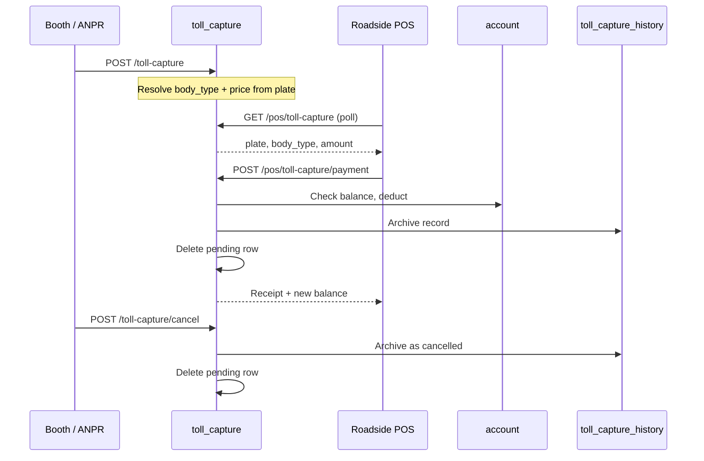

# Toll Capture API Guide

This document describes the **Toll Capture** feature in BCMS Pro: how a vehicle at a toll booth is registered, displayed on the roadside POS, paid via card or QR, archived, or cancelled.

All paths below are relative to the API prefix, e.g. `https://<host>/api`.

---

## Overview



### Tables

| Table | Purpose |
|-------|---------|
| `toll_capture` | **One pending vehicle per lane** — current vehicle waiting at the booth for POS payment |
| `toll_capture_history` | **Permanent archive** — every paid or cancelled capture is moved here |

### Migrations

Migrations live in their own folder:

```
database/migrations/toll_capture/
├── 2026_06_10_100000_create_toll_capture_table.php      # image = VARCHAR(500) file path
├── 2026_06_10_100001_create_toll_capture_history_table.php
└── 2026_06_11_100000_change_toll_capture_image_to_longtext.php  # normalizes image to VARCHAR(500) on older envs
```

They are auto-loaded via `AppServiceProvider`. Run only this feature's migrations:

```bash
php artisan migrate --path=database/migrations/toll_capture
```

Or run all migrations (includes toll capture):

```bash
php artisan migrate
```

Rollback only toll capture tables:

```bash
php artisan migrate:rollback --path=database/migrations/toll_capture
```

---

## Authentication

| Endpoint group | Auth |
|----------------|------|
| Booth / ANPR (`POST /toll-capture`, `POST /toll-capture/cancel`) | **Public** — no token required |
| POS (`GET /pos/toll-capture`, `POST /pos/toll-capture/payment`) | **Public** — validated by registered POS terminal (`mac_address` + `lane_number`) |
| History (`GET /toll-capture/history`) | **Public** — consider restricting in production if needed |

Use `Accept: application/json` and `Content-Type: application/json` on all requests.

---

## Response envelope

Most endpoints use the standard BCMS envelope:

```json
{
  "success": true,
  "status_code": 1,
  "data": { },
  "message": "Human-readable message"
}
```

Errors:

```json
{
  "success": false,
  "status_code": 0,
  "message": "Error description",
  "data": { }
}
```

`GET /toll-capture/history` returns pagination at the root (same pattern as vehicle listing).

---

## 1. Register vehicle at booth

**`POST /toll-capture`**

Same request pattern as **`POST /api/vehicles/update`**: JSON body with optional base64 image, or multipart `capture_image` (File).

| Vehicle update | Toll capture |
|----------------|--------------|
| `vehicle_image` / `vehicle_image_base64` | `capture_image` / `capture_image_base64` |
| `clear_vehicle_image` | `clear_capture_image` |
| `POST /api/vehicles/update` | `POST /api/toll-capture` |
| `PUT /api/vehicles/image` | `PUT /api/toll-capture/image` |

Legacy aliases still accepted: `image`, `vehicle_image_base64`, etc.

### Request body

| Field | Required | Description |
|-------|----------|-------------|
| `plate_no` | Yes | Vehicle plate number |
| `lane_number` | No* | Lane number string (e.g. `"1"`) |
| `lane_id` | No* | Numeric lane ID |
| `body_type_id` | No | Body type; auto-resolved from `vehicle` table if omitted |
| `amount` | No | Toll amount; auto-resolved from `price_list` if omitted |
| `capture_image` | No | Multipart **File**, or JSON string (base64 / `data:image/...;base64,...`) — same pattern as `vehicle_image` on vehicle update |
| `capture_image_base64` | No | Explicit base64 / data-URI field (same pattern as `vehicle_image_base64`) |
| `shift_id` | No | Active shift ID |
| `user_id` | No | Booth operator ID |

\* Provide at least one of `lane_number` or `lane_id`.

**Legacy aliases** (still accepted): `image`, `image_base64`, `image_file` (multipart File), `vehicle_image`, `vehicle_image_base64`.

### Example request (JSON — recommended for large ANPR photos)

```json
{
  "plate_no": "T123ABC",
  "lane_number": "1",
  "lane_id": 1,
  "body_type_id": 175,
  "shift_id": 4,
  "user_id": 12,
  "capture_image_base64": "data:image/jpeg;base64,/9j/4AAQSkZJRg..."
}
```

Or put the same base64 string in `capture_image` instead of `capture_image_base64`.

### Example request (multipart)

`POST /api/toll-capture` with `Content-Type: multipart/form-data`:

| Field | Type | Value |
|-------|------|-------|
| `plate_no` | Text | `T123ABC` |
| `lane_number` | Text | `1` |
| `capture_image` | **File** | JPEG/PNG from camera |

Use **POST** (not PUT) for large payloads. Set `Content-Type: application/json` when sending base64 in JSON.

### Example success response

```json
{
  "success": true,
  "status_code": 1,
  "message": "Toll capture recorded successfully",
  "data": {
    "id": 7,
    "plate_no": "T123ABC",
    "lane_id": 1,
    "lane_number": "1",
    "body_type_id": 2,
    "body_type": {
      "id": 2,
      "name": "Saloon",
      "description": "Light vehicle"
    },
    "amount": 1500,
    "image": "tc_T123ABC_L1_20260610143000_a1b2c3d4.jpg",
    "image_url": "https://<host>/api/toll-capture/7/image",
    "status": "pending",
    "vehicle_id": 45,
    "shift_id": 4,
    "created_at": "2026-06-10 14:30:00"
  }
}
```

### Business rules

- Plate is normalised to uppercase.
- If the vehicle exists in `vehicle`, `body_type_id`, `vehicle_id`, and price are resolved automatically.
- Price comes from active `price_list` row for the body type.
- Any previous **pending** capture on the same lane is removed before inserting the new one.
- ANPR sends base64 in `capture_image` or `capture_image_base64` (legacy: `image` / `vehicle_image_base64`); the API decodes it, writes a PNG under the toll capture images directory, and stores the **filename** in `toll_capture.image`.
- The registered vehicle photo in `vehicle.image` is **not** used.

### Common errors

| Message | Cause |
|---------|-------|
| `Unable to determine toll amount` | Unknown plate and no `body_type_id` / `amount` supplied |
| `Validation failed` | Missing `plate_no` or invalid field values |
| `Request body was not received` | nginx/proxy dropped the JSON body before PHP (see below) |

### Large JSON body / `Request body was not received`

If the response shows `content_length_header` (~260KB+) but `parsed_fields: []` and `post_max_size: 8M`, **PHP limits are not the problem** — nginx (or another proxy) is discarding the body before it reaches Laravel.

**Server fix (recommended):** in nginx, inside the `server` or `location` block for this API:

```nginx
client_max_body_size 32m;
```

Reload nginx. Also ensure PHP `post_max_size` and `upload_max_filesize` are at least `32M`.

**Client workaround (two-step, same pattern as vehicle image update):**

**Step 1 — register capture without image** (small JSON, always passes proxy limits):

```json
POST /api/toll-capture
Content-Type: application/json

{
  "plate_no": "T564DVF",
  "lane_number": "A2",
  "lane_id": 1,
  "body_type_id": 175,
  "shift_id": 1,
  "user_id": 33
}
```

Note the returned `data.id` (e.g. `7`).

**Step 2 — upload image only** (mirrors `PUT /api/vehicles/image`):

```json
POST /api/toll-capture/image
Content-Type: application/json

{
  "toll_capture_id": 7,
  "capture_image_base64": "data:image/jpeg;base64,..."
}
```

`PUT /api/toll-capture/image` is also accepted. Use `capture_image` instead of `capture_image_base64` if you prefer (same as vehicle update). Set `"remove": true` to clear the image without deleting the capture.

### Image storage

| Item | Value |
|------|-------|
| Disk folder | `storage/app/toll-capture-images` (override: `TOLL_CAPTURE_IMAGES_PATH`) |
| DB column | `image` — filename only, e.g. `tc_T342DXZ_L1_20260611001500_x7y8z9ab.jpg` |
| Max size | 26 MB decoded (override: `TOLL_CAPTURE_MAX_IMAGE_BYTES`) — same default as vehicle images |
| Max base64 JSON length | 30M chars (override: `TOLL_CAPTURE_MAX_BASE64_CHARS`) |
| Multipart max | 20 MB (override: `TOLL_CAPTURE_MAX_FILE_UPLOAD_KB`) |
| Serve file | `GET /api/toll-capture/{id}/image` |

---

## 2. POS — get pending vehicle

**`GET /pos/toll-capture`**

The roadside POS polls this endpoint (recommended every 3 seconds) to check whether a vehicle is waiting at its lane.

### Query parameters

| Parameter | Required | Description |
|-----------|----------|-------------|
| `lane_number` | Yes | Lane configured on the POS terminal |
| `mac_address` | Yes | Device MAC address (must match a registered `pos_terminals` row) |

### Example request

```
GET /api/pos/toll-capture?lane_number=1&mac_address=AA:BB:CC:DD:EE:FF
```

### Example — vehicle waiting

```json
{
  "success": true,
  "status_code": 1,
  "message": "Vehicle at booth retrieved successfully",
  "data": {
    "id": 7,
    "plate_no": "T123ABC",
    "lane_number": "1",
    "body_type": {
      "id": 2,
      "name": "Saloon",
      "description": "Light vehicle"
    },
    "amount": 1500,
    "status": "pending",
    "created_at": "2026-06-10 14:30:00"
  }
}
```

### Example — no vehicle

```json
{
  "success": true,
  "status_code": 1,
  "message": "No vehicle at booth",
  "data": null
}
```

### Common errors

| Message | Cause |
|---------|-------|
| `POS terminal not registered` | MAC + lane not found in `pos_terminals` |
| `POS terminal is not active` | Terminal status is not `active` |

---

## 3. POS — process payment

**`POST /pos/toll-capture/payment`**

Deducts the capture amount from the customer's toll account, records a `toll_transaction`, archives the capture, and removes it from `toll_capture`.

### Request body

| Field | Required | Description |
|-------|----------|-------------|
| `toll_capture_id` | Yes | ID from `GET /pos/toll-capture` |
| `lane_number` | Yes | Must match the capture's lane |
| `mac_address` | Yes | Registered POS terminal MAC |
| `card_reference` | No* | NFC card UID (8-char hex) |
| `account_no` | No* | Account number (QR flow) |
| `reference_number` | No | Client reference; auto-generated if omitted |
| `description` | No | Payment description |

\* Provide exactly one of `card_reference` or `account_no`.

### Card payment example

```json
{
  "toll_capture_id": 7,
  "card_reference": "A1B2C3D4",
  "lane_number": "1",
  "mac_address": "AA:BB:CC:DD:EE:FF",
  "reference_number": "POS_1718032200_1"
}
```

### QR payment example

```json
{
  "toll_capture_id": 7,
  "account_no": "ACC-000123",
  "lane_number": "1",
  "mac_address": "AA:BB:CC:DD:EE:FF",
  "reference_number": "QR_1718032200_1"
}
```

### Example success response

```json
{
  "success": true,
  "status_code": 1,
  "message": "Payment processed successfully",
  "data": {
    "plate_no": "T123ABC",
    "amount": 1500,
    "account_no": "ACC-000123",
    "previous_balance": 5000,
    "new_balance": 3500,
    "receipt_num": "B10452",
    "reference_number": "POS_1718032200_1",
    "toll_transaction_id": 8821
  }
}
```

### What happens on success

1. Account balance is checked and reduced by the capture `amount`.
2. A `toll_transaction` is created with the real `plate_no` and `body_type_id`.
3. An `account_balance_history` row is written.
4. The capture is copied to `toll_capture_history` with `payment_method` = `card_deduction` or `qr_payment`.
5. The row is deleted from `toll_capture`.

### Common errors

| Message | Cause |
|---------|-------|
| `No pending toll capture found` | Capture already paid, cancelled, or wrong ID |
| `Toll capture does not belong to this lane` | `lane_number` mismatch |
| `Account not found` | Invalid card or account number |
| `Insufficient balance` | Account balance below toll amount |

---

## 4. Cancel pending capture

**`POST /toll-capture/cancel`**

Used by booth operators when the wrong vehicle was captured, the vehicle left without paying, or the lane must be cleared manually.

### Request body

| Field | Required | Description |
|-------|----------|-------------|
| `toll_capture_id` | No* | Specific capture to cancel |
| `lane_number` | No* | Cancel the latest pending capture on this lane |
| `lane_id` | No | Extra filter when using `lane_number` |
| `user_id` | No | Operator who cancelled |
| `reason` | No | Free-text reason (stored in history `notes`) |

\* Provide `toll_capture_id` **or** `lane_number`.

### Example — cancel by lane

```json
{
  "lane_number": "1",
  "user_id": 12,
  "reason": "Vehicle reversed out of lane"
}
```

### Example — cancel by ID

```json
{
  "toll_capture_id": 7,
  "reason": "Wrong plate detected"
}
```

### Example success response

```json
{
  "success": true,
  "status_code": 1,
  "message": "Toll capture cancelled successfully",
  "data": {
    "archived_id": 15,
    "plate_no": "T123ABC",
    "lane_number": "1"
  }
}
```

### What happens on cancel

1. The pending capture is archived to `toll_capture_history`.
2. `payment_method` is set to `cancelled`.
3. `notes` stores the optional `reason`.
4. `paid_at` is `null`.
5. The row is deleted from `toll_capture`.

---

## 5. List capture history

**`GET /toll-capture/history`**

Returns archived captures (paid and cancelled) with pagination.

### Query parameters

| Parameter | Description |
|-----------|-------------|
| `plate_no` | Filter by plate |
| `lane_number` | Filter by lane |
| `payment_method` | `card_deduction`, `qr_payment`, or `cancelled` |
| `from_date` | `YYYY-MM-DD` |
| `to_date` | `YYYY-MM-DD` |
| `per_page` | Default `15`, max `100` |
| `page` | Page number |

### Example request

```
GET /api/toll-capture/history?lane_number=1&payment_method=card_deduction&per_page=20
```

### Example response

```json
{
  "success": true,
  "status_code": 1,
  "message": "Toll capture history retrieved successfully",
  "data": [
    {
      "id": 15,
      "toll_capture_id": 7,
      "plate_no": "T123ABC",
      "lane_number": "1",
      "amount": 1500,
      "account_no": "ACC-000123",
      "payment_method": "card_deduction",
      "receipt_num": "B10452",
      "toll_transaction_id": 8821,
      "notes": null,
      "captured_at": "2026-06-10 14:30:00",
      "paid_at": "2026-06-10 14:31:12",
      "created_at": "2026-06-10 14:31:12"
    }
  ],
  "pagination": {
    "current_page": 1,
    "last_page": 1,
    "per_page": 20,
    "total": 1,
    "from": 1,
    "to": 1
  }
}
```

---

## Endpoint summary

| Method | Endpoint | Used by | Purpose |
|--------|----------|---------|---------|
| `POST` | `/toll-capture` | Booth / ANPR | Register current vehicle at lane |
| `POST` / `PUT` | `/toll-capture/image` | Booth / ANPR | Attach/replace/remove ANPR image on pending capture |
| `POST` | `/toll-capture/cancel` | Booth operator | Cancel pending capture |
| `GET` | `/toll-capture/{id}/image` | POS / booth | Serve stored ANPR photo |
| `GET` | `/toll-capture/history` | Back office / reports | List archived captures |
| `GET` | `/pos/toll-capture` | Roadside POS | Poll for pending vehicle |
| `POST` | `/pos/toll-capture/payment` | Roadside POS | Pay via NFC card or QR account |

---

## POS integration checklist

1. **Register the POS terminal** in `pos_terminals` with matching `mac_address` and `lane_number`.
2. **Configure the POS app** with the correct base URL and lane.
3. **Poll** `GET /pos/toll-capture` every ~3 seconds.
4. When `data` is not null, display `plate_no`, `body_type.name`, and `amount`.
5. On NFC tap or QR scan, call `POST /pos/toll-capture/payment` with `toll_capture_id`.
6. On success, clear the UI and continue polling for the next vehicle.

### Related POS endpoints (unchanged)

| Endpoint | When used |
|----------|-----------|
| `GET /portal/public/lanes` | POS setup — lane picker |
| `POST /qr/decrypt` | QR flow — decrypt toll card QR before payment |
| `POST /pos/balance-deduction` | Legacy fixed-amount payment when no toll capture exists |

---

## `toll_capture` status values

| Status | Meaning |
|--------|---------|
| `pending` | Waiting for POS payment |
| `processing` | Reserved for future use |
| `cancelled` | Set only in history after cancel |

---

## `toll_capture_history.payment_method` values

| Value | Meaning |
|-------|---------|
| `card_deduction` | Paid via NFC card on POS |
| `qr_payment` | Paid via QR-decrypted account |
| `cancelled` | Removed by booth operator without payment |

---

## Testing without ANPR

When ANPR is not connected, you can insert a pending capture manually.

### Option A — Artisan command (recommended)

On the BCMS server (after migrations):

```bash
# Default: lane 1, first vehicle in DB (or plate TEST001, amount 1500)
php artisan toll-capture:seed-test

# Match your POS lane configuration
php artisan toll-capture:seed-test --lane-number=2

# Use a specific plate (resolves body type + price from vehicle table)
php artisan toll-capture:seed-test --plate=T123ABC --lane-number=1

# Fixed amount override
php artisan toll-capture:seed-test --amount=2000

# Include a test ANPR image (base64 string)
php artisan toll-capture:seed-test --image="data:image/jpeg;base64,..."

# Clear pending captures on all lanes, then seed
php artisan toll-capture:seed-test --clear
```

Via seeder:

```bash
php artisan db:seed --class=TollCaptureDummySeeder
```

### Option B — HTTP (same as ANPR would call)

```bash
curl -X POST https://<host>/api/toll-capture \
  -H "Content-Type: application/json" \
  -H "Accept: application/json" \
  -d '{
    "plate_no": "T123ABC",
    "lane_number": "1",
    "lane_id": 1,
    "amount": 1500
  }'
```

Use a `plate_no` that exists in `vehicle` if you want body type and price resolved automatically.

**Note:** Test seeding leaves `image` empty unless you pass `--image` with base64 (saved to disk like live ANPR). Live ANPR must POST base64 in `image`; the API stores only the file path in the DB.

### Verify from POS

1. Ensure POS **lane number** matches the seeded lane (e.g. `1`).
2. Ensure the POS **MAC address** is registered in `pos_terminals` for that lane.
3. Open the POS app — it polls every 3 seconds and should show plate, body type, and amount.
4. Tap NFC card or scan QR to complete `POST /api/pos/toll-capture/payment`.

### Clear a test capture

```bash
curl -X POST https://<host>/api/toll-capture/cancel \
  -H "Content-Type: application/json" \
  -d '{"lane_number": "1", "reason": "Test complete"}'
```

---

## Files reference

| File | Role |
|------|------|
| `database/migrations/toll_capture/` | Table migrations |
| `app/Models/TollCapture.php` | Active capture model |
| `app/Models/TollCaptureHistory.php` | Archive model |
| `app/Http/Controllers/Booth/TollCaptureController.php` | All toll capture endpoints |
| `app/Services/TollCapture/TollCaptureImageStorageService.php` | ANPR base64 → disk file |
| `config/toll_capture.php` | Image folder and size limits |
| `routes/api.php` | Route definitions |
| `docs/toll-capture-api.md` | This guide |
| `app/Console/Commands/SeedTollCaptureTestData.php` | `toll-capture:seed-test` dummy data command |
| `database/seeders/TollCaptureDummySeeder.php` | Seeder wrapper for test data |
